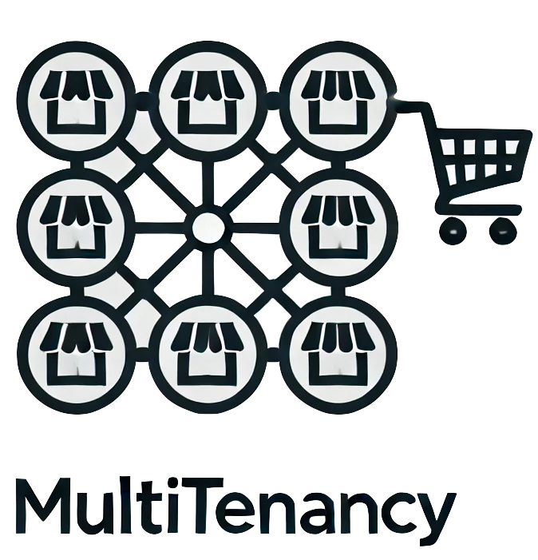

<div align="center">
    
</div>

# xShop Multitenancy Package

> [!NOTE]
> This package provides multitenancy support for xShop, facilitating the management of multiple tenant databases.

## New Features

- Database creation for each tenant.
- Tenant-specific migrations and seeders.
- Automatic admin user creation for tenants.

## Installation

To install the package, follow these steps:

```bash
composer require sadeghpm/xshop-multitenancy
```
## Multitenancy Setup

### Initial Setup

Run the multitenancy:setup command to configure multitenancy:
```bash
php artisan multitenancy:setup
```
### Adding Tenants

To add new tenants, use the multitenancy:create-tenant command:
```bash
php artisan multitenancy:create-tenant
```
This command will:
1. Ask for the tenant's name and domain.
2. Create the tenant in the database.
3. Prompt for admin user details and create the admin user for the new tenant.

### Summary

- multitenancy:setup: For initial configuration and creating the first tenant.
- multitenancy:create-tenant: For adding new tenants.
- multitenancy:list-tenants : To list all tenants.

<p> 
    Developed With Love! ❤️
</p>
